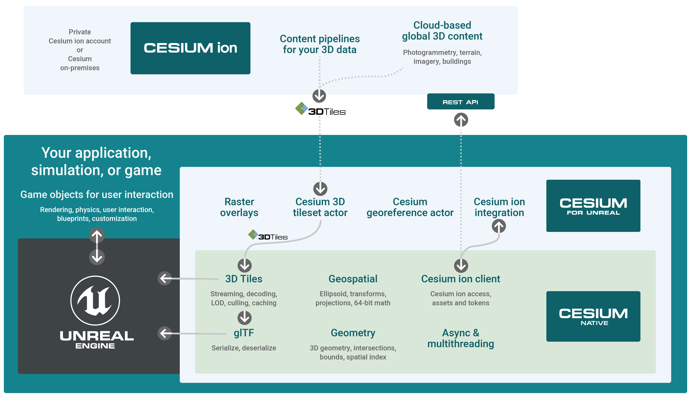

# Cesium Native

Cesium Native is a set of C++ libraries for 3D geospatial, including:

* [3D Tiles](https://github.com/CesiumGS/3d-tiles) runtime streaming
* lightweight glTF serialization and deserialization, and
* high-precision 3D geospatial math types and functions, including support for global-scale WGS84 ellipsoids.

Currently Cesium Native is used to develop [Cesium for Unreal](https://github.com/CesiumGS/cesium-unreal) and [Cesium for O3DE](https://github.com/CesiumGS/cesium-o3de). In the future, we plan for Cesium Native to be a foundational layer for any 3D geospatial software, especially those that want to stream 3D Tiles.

*
A high-level architecture of Cesium for Unreal, Cesium Native and Unreal Engine streaming content from Cesium ion.
*

### :card_file_box: Libraries Overview

| Library | Description |
| -- | -- |
| **Cesium3DTiles** | Lightweight 3D Tiles classes. |
| **Cesium3DTilesReader** | 3D Tiles deserialization, including 3D Tiles extension support. |
| **Cesium3DTilesWriter** | 3D Tiles serialization, including 3D Tiles extension support. |
| **Cesium3DTilesSelection** | Runtime streaming, decoding, level of detail selection, culling, cache management, and decoding of 3D Tiles. |
| **CesiumAsync** | Classes for multi-threaded asynchronous tasks. |
| **CesiumGeometry** | Common 3D geometry classes; and bounds testing, intersection testing, and spatial indexing algorithms. |
| **CesiumGeospatial** | 3D geospatial math types and functions for ellipsoids, transforms, projections. |
| **CesiumGltf** | Lightweight glTF processing and optimization functions. |
| **CesiumGltfReader** | glTF deserialization / decoding, including glTF extension support (`KHR_draco_mesh_compression` etc). |
| **CesiumGltfWriter** | glTF serialization / encoding, including glTF extension support. |
| **CesiumIonClient** | Functions to access [Cesium ion](https://cesium.com/cesium-ion/) accounts and 3D tilesets using ion's REST API. |
| **CesiumJsonReader** | Reads JSON from a buffer into statically-typed classes. |
| **CesiumJsonWriter** | Writes JSON from statically-typed classes into a buffer. |
| **CesiumUtility** | Utility functions for JSON parsing, URI processing, etc. |

### :green_book:License

[Apache 2.0](http://www.apache.org/licenses/LICENSE-2.0.html). Cesium Native is free for both commercial and non-commercial use.

## 🚀Getting Started

There are a few common ways to use Cesium Native. Click a link below for instructions:

* [Install with Conan](doc/install-with-conan.md): Start using Cesium Native quickly by using packaged releases from the Conan Package Manager.
* [Development Workflow](doc/development-workflow.md): Compile Cesium Native yourself, run the tests, and perhaps use your modified version in another application.
* [Create Conan Packages](doc/creating-conan-packages.md): Create Cesium Native packages in your local Conan cache, to publish to a Conan repository or use in other applications.
