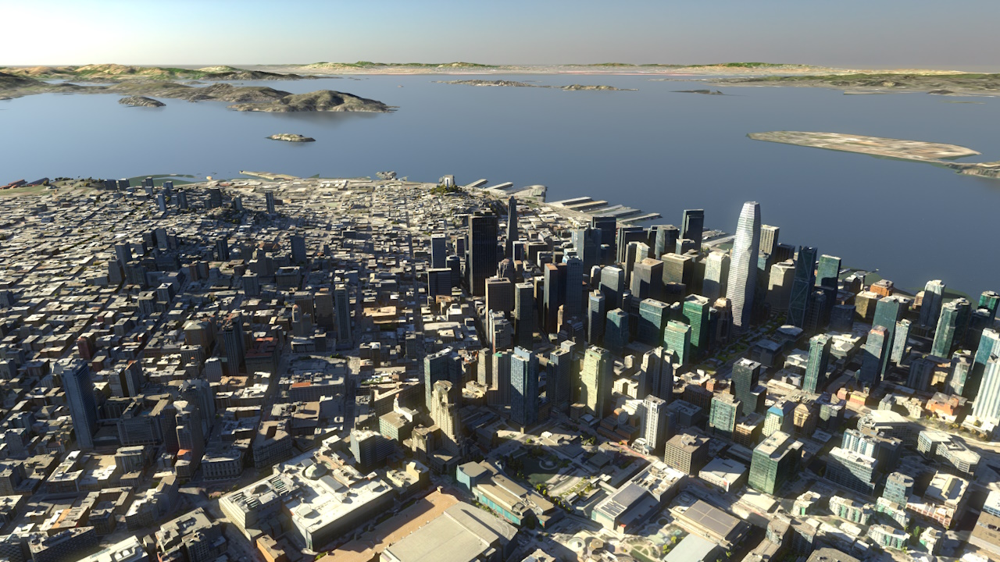

# Cesium Native

📚<a href="https://cesium.com/learn/cesium-native/ref-doc/">Documentation</a> - 📒<a href="CHANGES.md">Change Log</a> - 💬<a href="https://community.cesium.com/">Community Forums</a>

## 📖About

Cesium Native is a set of C++ libraries for 3D geospatial, including:

* [3D Tiles](https://github.com/CesiumGS/3d-tiles) runtime streaming
* lightweight glTF serialization and deserialization
* high-precision 3D geospatial math types and functions, including support for global-scale WGS84 ellipsoids.
* support for draping raster overlays from WMS, TMS, WMTS, and other sources over 3D tilesets

Cesium Native powers Cesium's runtime integrations for [Cesium for Unreal](https://github.com/CesiumGS/cesium-unreal), [Cesium for Unity](https://github.com/CesiumGS/cesium-unity), [Cesium for Omniverse](https://github.com/CesiumGS/cesium-omniverse), and [Cesium for O3DE](https://github.com/CesiumGS/cesium-o3de). Cesium Native is the foundational layer for any 3D geospatial software, especially those that want to stream 3D Tiles. See [Projects Using Cesium Native](#projects-using-cesium-native) for a list of projects currently integrating with Cesium Native.

<em>A high-level Cesium platform architecture with the runtime integrations powered by Cesium Native and streaming content from Cesium ion.</em>

## 📷Screenshots

<table>
  <tbody>
    <tr>
      <td>
        <!--! \if DOXYGEN_EXCLUDE -->
        
        <!--! \endif -->
        <!--! \image html screenshot-googleplex.jpg -->
        
The Googleplex in Mountain View, California, USA, visualized with Google Photorealistic 3D Tiles in Cesium for Unity.

      </td>
      <td>
        <!--! \if DOXYGEN_EXCLUDE -->
        
        <!--! \endif -->
        <!--! \image html screenshot-ny-metadata.jpg -->
        
Cesium OSM Buildings in Cesium for Unreal with shading from metadata on building height and age.

      </td>
    </tr>
    <tr>
      <td>
        <!--! \if DOXYGEN_EXCLUDE -->
        
        <!--! \endif -->
        <!--! \image html screenshot-copernicus-crater.jpg -->
        
The Copernicus Crater, visualized with Cesium Moon Terrain in Cesium for Unreal. &nbsp;<!-- fake third line to align the two images and captions -->

      </td>
      <td>
        <!--! \if DOXYGEN_EXCLUDE -->
        
        <!--! \endif -->
        <!--! \image html screenshot-san-francisco.jpg -->
        
Cesium for Omniverse scene set in San Francisco, California, USA. Data courtesy Aerometrex.

      </td>
    </tr>
  </tbody>
</table>

## 🗃️Libraries Overview

| Library                        | Description                                                                                                     |
| ------------------------------ | --------------------------------------------------------------------------------------------------------------- |
| **Cesium3DTiles**              | Lightweight 3D Tiles classes.                                                                                   |
| **Cesium3DTilesContent**       | Classes that support loading and converting 3D Tiles tile content.                                              |
| **Cesium3DTilesReader**        | 3D Tiles deserialization, including 3D Tiles extension support.                                                 |
| **Cesium3DTilesWriter**        | 3D Tiles serialization, including 3D Tiles extension support.                                                   |
| **Cesium3DTilesSelection**     | Runtime streaming, level of detail selection, culling, cache management, and decoding of 3D Tiles.              |
| **CesiumAsync**                | Classes for multi-threaded asynchronous tasks.                                                                  |
| **CesiumGeometry**             | Common 3D geometry classes; and bounds testing, intersection testing, and spatial indexing algorithms.          |
| **CesiumGeospatial**           | 3D geospatial math types and functions for ellipsoids, transforms, projections.                                 |
| **CesiumGltf**                 | Lightweight glTF processing and optimization functions.                                                         |
| **CesiumGltfContent**          | Classes that support manipulating the content of a glTF.                                                        |
| **CesiumGltfReader**           | glTF deserialization / decoding, including glTF extension support (`KHR_draco_mesh_compression` etc).           |
| **CesiumGltfWriter**           | glTF serialization / encoding, including glTF extension support.                                                |
| **CesiumIonClient**            | Functions to access [Cesium ion](https://cesium.com/cesium-ion/) accounts and 3D tilesets using ion's REST API. |
| **CesiumJsonReader**           | Reads JSON from a buffer into statically-typed classes.                                                         |
| **CesiumJsonWriter**           | Writes JSON from statically-typed classes into a buffer.                                                        |
| **CesiumQuantizedMeshTerrain** | Classes for accessing terrain in the [quantized-mesh-1.0](https://github.com/CesiumGS/quantized-mesh) format.   |
| **CesiumRasterOverlays**       | Classes for raster overlays, which allow draping massive 2D textures over a model.                              |
| **CesiumUtility**              | Utility functions for JSON parsing, URI processing, credits, etc.                                               |

## 📗License

[Apache 2.0](http://www.apache.org/licenses/LICENSE-2.0.html). Cesium Native is free for both commercial and non-commercial use.

## 🔧Projects Using Cesium Native

The following official Cesium integrations are built on top of Cesium Native:

- [Cesium for Unreal](https://github.com/CesiumGS/cesium-unreal)
- [Cesium for Unity](https://github.com/CesiumGS/cesium-unity)
- [Cesium for Omniverse](https://github.com/CesiumGS/cesium-omniverse)
- [Cesium for O3DE](https://github.com/CesiumGS/cesium-o3de)

In addition, Cesium Native has been used by the community to build projects including:
- [vsgCs](https://github.com/timoore/vsgCs) integrates Cesium Native with VulkanSceneGraph.
- [osgEarth](https://github.com/gwaldron/osgearth) uses Cesium Native to load 3D Tiles in OpenSceneGraph.

If you have a project that integrates with Cesium Native that isn't on this list yet, please let us know!

## ⌛ Backward Compatibility

Cesium Native currently does not have any measures for deprecation or backwards compatibility. This grants us the mobility needed for rapid, iterative development.

Breaking changes can be made without warning, but they should be well-documented under the `Breaking Changes` section in [CHANGES.md](CHANGES.md).

> [!note]
> This will change when Cesium Native is officially released as v1.0.0 with a stabilized API.

## 💻Developing with Cesium Native

See the [Developer Setup Guide](doc/topics/developer-setup.md) to learn how to set up a development environment with Cesium Native and begin developing with it.

## ⭐Contributing

Are you interested in contributing to Cesium Native's development? Contributions can come in many forms, from answering questions to creating issues and pull requests. See our [Contribution Guide](CONTRIBUTING.md) to find out how to get started!
