<!-- omit in toc -->
# Cesium Native

[](https://github.com/CesiumGS/cesium-native/blob/main/LICENSE)
[](https://github.com/CesiumGS/cesium-native/actions/workflows/build.yml)
[](https://github.com/CesiumGS/cesium-native/tags)

<!-- omit in toc -->
## Table of Contents

- [📖About](#about)
  - [🗃️Libraries Overview](#️libraries-overview)
  - [📗License](#license)
  - [🔧Projects Using Cesium Native](#projects-using-cesium-native)
  - [📦Dependencies](#dependencies)
- [💻Developers](#developers)
  - [⭐Prerequisites](#prerequisites)
  - [🚀Getting Started](#getting-started)
    - [Clone the repo](#clone-the-repo)
    - [Compile from command line](#compile-from-command-line)
    - [Compile from Visual Studio Code](#compile-from-visual-studio-code)
    - [Compile with any Visual Studio version using CMake generated projects](#compile-with-any-visual-studio-version-using-cmake-generated-projects)
    - [Generate Documentation](#generate-documentation)
    - [Regenerate glTF and 3D Tiles classes](#regenerate-gltf-and-3d-tiles-classes)
    - [Regenerate Dependency Graphs](#regenerate-dependency-graphs)


## 📖About

Cesium Native is a set of C++ libraries for 3D geospatial, including:

* [3D Tiles](https://github.com/CesiumGS/3d-tiles) runtime streaming
* lightweight glTF serialization and deserialization
* high-precision 3D geospatial math types and functions, including support for global-scale WGS84 ellipsoids.
* support for draping raster overlays from WMS, TMS, WMTS, and other sources over 3D tilesets

Cesium Native powers Cesium's runtime integrations for [Cesium for Unreal](https://github.com/CesiumGS/cesium-unreal), [Cesium for Unity](https://github.com/CesiumGS/cesium-unity), [Cesium for Omniverse](https://github.com/CesiumGS/cesium-omniverse), and [Cesium for O3DE](https://github.com/CesiumGS/cesium-o3de). Cesium Native is the foundational layer for any 3D geospatial software, especially those that want to stream 3D Tiles.


*<p align="center">A high-level Cesium platform architecture with the runtime integrations powered by Cesium Native and streaming content from Cesium ion.</p>*

### 🗃️Libraries Overview

| Library                        | Description                                                                                                     |
| ------------------------------ | --------------------------------------------------------------------------------------------------------------- |
| **Cesium3DTiles**              | Lightweight 3D Tiles classes.                                                                                   |
| **Cesium3DTilesContent**       | Classes that support loading and converting 3D Tiles tile content.                                              |
| **Cesium3DTilesReader**        | 3D Tiles deserialization, including 3D Tiles extension support.                                                 |
| **Cesium3DTilesWriter**        | 3D Tiles serialization, including 3D Tiles extension support.                                                   |
| **Cesium3DTilesSelection**     | Runtime streaming, level of detail selection, culling, cache management, and decoding of 3D Tiles.              |
| **CesiumAsync**                | Classes for multi-threaded asynchronous tasks.                                                                  |
| **CesiumGeometry**             | Common 3D geometry classes; and bounds testing, intersection testing, and spatial indexing algorithms.          |
| **CesiumGeospatial**           | 3D geospatial math types and functions for ellipsoids, transforms, projections.                                 |
| **CesiumGltf**                 | Lightweight glTF processing and optimization functions.                                                         |
| **CesiumGltfContent**          | Classes that support manipulating the content of a glTF.                                                        |
| **CesiumGltfReader**           | glTF deserialization / decoding, including glTF extension support (`KHR_draco_mesh_compression` etc).           |
| **CesiumGltfWriter**           | glTF serialization / encoding, including glTF extension support.                                                |
| **CesiumIonClient**            | Functions to access [Cesium ion](https://cesium.com/cesium-ion/) accounts and 3D tilesets using ion's REST API. |
| **CesiumJsonReader**           | Reads JSON from a buffer into statically-typed classes.                                                         |
| **CesiumJsonWriter**           | Writes JSON from statically-typed classes into a buffer.                                                        |
| **CesiumQuantizedMeshTerrain** | Classes for accessing terrain in the [quantized-mesh-1.0](https://github.com/CesiumGS/quantized-mesh) format.   |
| **CesiumRasterOverlays**       | Classes for raster overlays, which allow draping massive 2D textures over a model.                              |
| **CesiumUtility**              | Utility functions for JSON parsing, URI processing, credits, etc.                                               |


### 📗License

[Apache 2.0](http://www.apache.org/licenses/LICENSE-2.0.html). Cesium Native is free for both commercial and non-commercial use.

### 🔧Projects Using Cesium Native

The following official Cesium integrations are built on top of Cesium Native:

- [Cesium for Unreal](https://github.com/CesiumGS/cesium-unreal)
- [Cesium for Unity](https://github.com/CesiumGS/cesium-unity)
- [Cesium for Omniverse](https://github.com/CesiumGS/cesium-omniverse)
- [Cesium for O3DE](https://github.com/CesiumGS/cesium-o3de)

In addition, Cesium Native has been used by the community to build projects including:
- [vsgCs](https://github.com/timoore/vsgCs) integrates Cesium Native with VulkanSceneGraph.
- [osgEarth](https://github.com/gwaldron/osgearth) uses Cesium Native to load 3D Tiles in OpenSceneGraph.

### 📦Dependencies

Cesium Native relies on various third-party packages to accomplish tasks like image decoding, URI parsing, and math operations. These dependencies are automatically obtained and built using [vcpkg](https://vcpkg.io/en/) when building through CMake. Below is a graph of all the Cesium Native libraries and their dependencies on third party packages and each other. [Click to view the full graph.](doc/img/dependency-graph.svg)



## 💻Developers

### ⭐Prerequisites

* Visual Studio 2019 (or newer), GCC v11.x+, Clang 12+. Other compilers are likely to work but are not regularly tested.
* CMake 3.15+
* For best JPEG-decoding performance, you must have [nasm](https://www.nasm.us/) installed so that CMake can find it. Everything will work fine without it, just slower.

### 🚀Getting Started

#### Clone the repo

Check out the repo with:

```bash
git clone git@github.com:CesiumGS/cesium-native.git --recurse-submodules
```

If you forget the `--recurse-submodules`, nothing will work because the git submodules will be missing. You should be able to fix it with:

```bash
git submodule update --init --recursive
```

#### Compile from command line

```bash
## Windows compilation using Visual Studio
cmake -B build -S . -G "Visual Studio 15 2017 Win64"
cmake --build build --config Debug
cmake --build build --config Release

## Linux compilation
cmake -B build -S .
cmake --build build
```

#### Compile from Visual Studio Code

1) Install the `CMake Tools` extension. It should prompt you to generate project files from CMake.
2) On Windows, choose `Visual Studio 2017 Release - amd64` as the kit to build. Or choose an appropriate kit for your platform.
3) Then press Ctrl-Shift-P and execute the `CMake: Build` task or press F7.

#### Compile with any Visual Studio version using CMake generated projects

1) Open the CMake UI (cmake-gui)
2) Under "Where is the source code", point to your repo
3) Specify your output folder in "Where to build the binaries"
4) Click "Configure".
5) Under "Specify the generator for this project", choose the VS version on your system
6) Click Finish, wait for the process to finish
7) Click Generate

Look for cesium-native.sln in your output folder.

Unit tests can also be run from this solution, under the cesium-native-tests project.


#### Generate Documentation

* Install [Doxygen](https://www.doxygen.nl/).
* Run: `npm install`
* Run: `cmake --build build --target cesium-native-docs`
* Open `build/doc/html/index.html`

#### Regenerate glTF and 3D Tiles classes

Much of the code in `CesiumGltf`, `Cesium3DTiles`, `CesiumGltfReader`, `Cesium3DTilesReader`, and `CesiumQuantizedMeshTerrain` is generated from the standards' JSON Schema specifications. To regenerate the code:

* Make sure you have a relatively recent version of Node.js installed.
* Install dependencies by running:

```
npm install
cd tools/generate-classes
npm install
cd ../..
```

* From the repo root directory, run these commands
  * `npm run generate-gltf`
  * `npm run generate-3d-tiles`
  * `npm run generate-quantized-mesh-terrain`
* On Windows, the line endings of the generated files will be different than those checked into the repo. Just `git add` them and git will fix the line endings (no need to commit).

#### Regenerate Dependency Graphs

The dependency graphs used in the Cesium Native documentation are generated using a script that parses CMake's GraphViz output and generates a set of Mermaid diagrams. To regenerate the graphs:

* Make sure you have a relatively recent version of Node.js installed.
* Install dependencies by running:
```
cd tools/dep-graph-gen
npm install
```
* From the `tools/dep-graph-gen` directory, run `npm run generate-dep-graph` to regenerate the graphs.