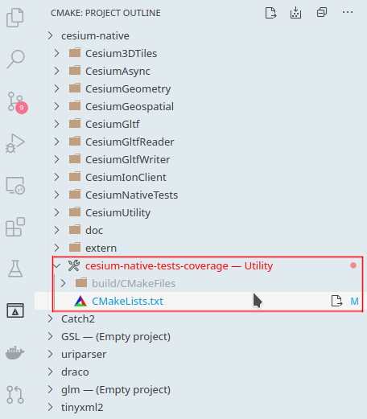

# Code Coverage
You can generate code coverage for the project by running the `cesium-native-tests-coverage`
target and then opening `index.html` inside `build/cesium-native-tests-coverage`. This is useful 
for ensuring that new code is covered by tests. Note that this target will only be defined if:

- The project is **not** being used as `git submodule`
- The active compiler in CMake is `g++`
- `gcovr` is installed and located in your program path.

If these requirements are all met, the `cesium-native-tests-coverage` target should be available.
You can also use the [CMake Extension](https://marketplace.visualstudio.com/items?itemName=ms-vscode.cmake-tools) for VSCode to run the coverage easily. Just run this target:

