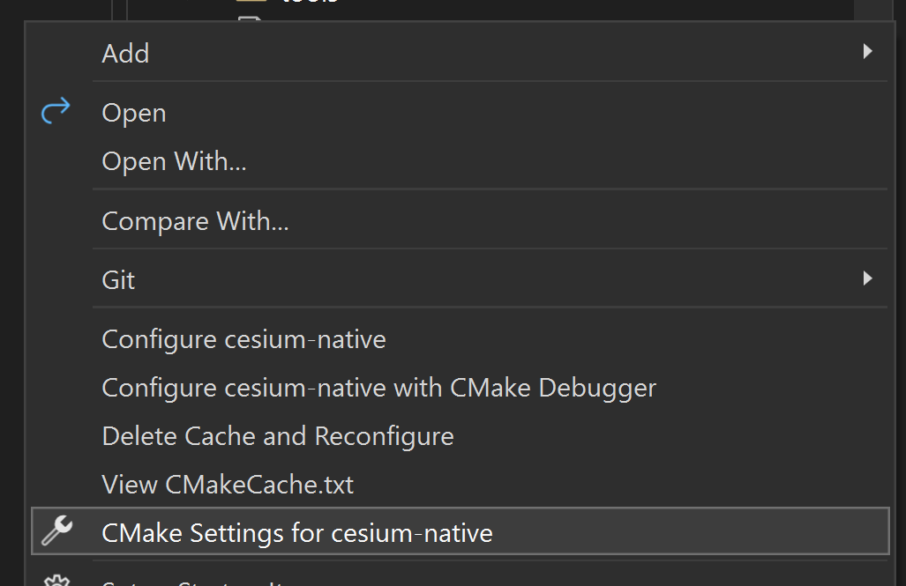
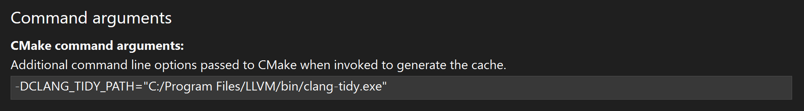
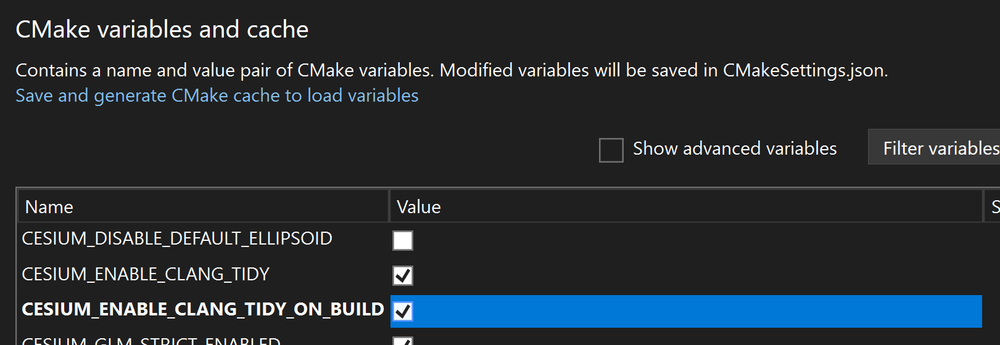

# Developer Setup Guide {#developer-setup}

This guide contains the basic setup information for developers looking to work with Cesium Native. **To follow this guide, you will need the following prerequisites:**

* Visual Studio 2019 (or newer), GCC v11.x+, or Clang 12+
  * Other compilers are likely to work but are not regularly tested.
* CMake 3.15+
* For best JPEG-decoding performance, you must have [nasm](https://www.nasm.us/) installed so that CMake can find it. Everything will work fine without it, just slower.
<!--! [TOC] -->

<!--! \cond DOXYGEN_EXCLUDE !-->

<!-- omit in toc -->
## Table of Contents

- [Clone the Repo](#clone-the-repo)
- [Compiling Cesium Native](#compiling-cesium-native)
  - [Compile from command line](#compile-from-command-line)
  - [Compile from Visual Studio Code](#compile-from-visual-studio-code)
  - [Compile with any Visual Studio version using CMake generated projects](#compile-with-any-visual-studio-version-using-cmake-generated-projects)
- [Generate Documentation](#generate-documentation)
- [Regenerate glTF and 3D Tiles classes](#regenerate-gltf-and-3d-tiles-classes)
- [Regenerate Dependency Graphs](#regenerate-dependency-graphs)
- [Run clang-tidy](#run-clang-tidy)

<!--! \endcond -->

## Clone the Repo

Check out the repo with:

```bash
git clone git@github.com:CesiumGS/cesium-native.git --recurse-submodules
```

If you forget the `--recurse-submodules`, nothing will work because the git submodules will be missing. You should be able to fix it with:

```bash
git submodule update --init --recursive
```

## Compiling Cesium Native

### Compile from command line

```bash
## Windows compilation using Visual Studio
cmake -B build -S . -G "Visual Studio 17 2022" -A x64
cmake --build build --config Debug
cmake --build build --config Release

## Linux compilation
cmake -B build -S .
cmake --build build
```

### Compile from Visual Studio Code

1) Install the `CMake Tools` extension. It should prompt you to generate project files from CMake.
2) On Windows, choose `Visual Studio 2017 Release - amd64` as the kit to build. Or choose an appropriate kit for your platform.
3) Then press Ctrl-Shift-P and execute the `CMake: Build` task or press F7.

### Compile with any Visual Studio version using CMake generated projects

1) Open the CMake UI (cmake-gui)
2) Under "Where is the source code", point to your repo
3) Specify your output folder in "Where to build the binaries"
4) Click "Configure".
5) Under "Specify the generator for this project", choose the VS version on your system
6) Click Finish, wait for the process to finish
7) Click Generate

Look for cesium-native.sln in your output folder.

Unit tests can also be run from this solution, under the cesium-native-tests project.


## Generate Documentation

* Install [Doxygen](https://www.doxygen.nl/).
* Run: `npm install`
* Run: `cmake --build build --target cesium-native-docs`
* Open `build/doc/html/index.html`

## Regenerate glTF and 3D Tiles classes

Much of the code in `CesiumGltf`, `Cesium3DTiles`, `CesiumGltfReader`, `CesiumGltfWriter`, `Cesium3DTilesReader`, `Cesium3DTilesWriter`, and `CesiumQuantizedMeshTerrain` is generated from the standards' JSON Schema specifications. To regenerate the code:

* Make sure you have a relatively recent version of Node.js installed.
* Install dependencies by running:

```
npm install
cd tools/generate-classes
npm install
cd ../..
```

* From the repo root directory, run these commands
  * `npm run generate-gltf`
  * `npm run generate-3d-tiles`
  * `npm run generate-quantized-mesh-terrain`
* On Windows, the line endings of the generated files will be different than those checked into the repo. Just `git add` them and git will fix the line endings (no need to commit).

## Regenerate Dependency Graphs

The dependency graphs used in the Cesium Native documentation are generated using a script that parses CMake's GraphViz output and generates a set of Mermaid diagrams. To regenerate the graphs:

* Make sure you have a relatively recent version of Node.js installed.
* Install dependencies by running:
```
cd tools/dep-graph-gen
npm install
```
* From the `tools/dep-graph-gen` directory, run `npm run generate-dep-graph` to regenerate the graphs.

## Run clang-tidy

We use [clang-tidy](https://clang.llvm.org/extra/clang-tidy/) to help improve the quality of the code, and an automated process that runs on every commit ensures that there are no clang-tidy warnings or errors. To run it locally, follow the instructions for your system.

### Windows

It's recommended to use [WSL2](https://learn.microsoft.com/en-us/windows/wsl/install) to run clang-tidy on Windows. The following instructions cover using clang-tidy through Visual Studio 2022's CMake support. To set up clang-tidy on WSL2, follow the Linux instructions below.

1. Install clang-tidy for Windows. This can be obtained from [the installer on the LLVM GitHub releases page](https://github.com/llvm/llvm-project/releases). Download `LLVM-19.x.x-win64.exe` and run the installer.

2. clang-tidy requires a `compile_commands.json` file to be generated in the build directory in order to run. This file is only generated with the cmake Ninja or Unix Makefile generators. Visual Studio 2022's CMake support uses the Ninja generator. Open the Cesium Native cmake project with Visual Studio 2022.

3. Right click on the root `CMakeLists.txt` and select "CMake Settings for cesium-native"


4. Specify the path to the installed `clang-tidy.exe` under "CMake command arguments":


5. Under "CMake variables and cache", check `CESIUM_ENABLE_CLANG_TIDY_ON_BUILD`:


6. Build cesium-native through Visual Studio 2022 as normal. clang-tidy will be invoked for each build command and its warnings and errors will appear in the build output.


### Linux

1. To get clang-tidy, install llvm 19+. For Debian-based systems, LLVM provides an easy install script:

```
wget https://apt.llvm.org/llvm.sh
chmod +x llvm.sh
sudo ./llvm.sh 19
```
Binaries and source releases for use with other platforms can be downloaded from the [LLVM GitHub releases page](https://github.com/llvm/llvm-project/releases).

2. cmake should detect the installed `clang-tidy-19` automatically, so the project can be configured normally:

```
cmake -B build -S .
```

3. Next, we run the clang-tidy target of Cesium Native's cmake build, which will run clang-tidy. clang-tidy produces a lot of not-very-useful output, so we send it to a file instead of the console:

```
cmake --build build --target clang-tidy > clang-tidy.log
```

4. Finally, we use `sed` to extract the errors and warnings from the log:

```
sed -n '/error:/,/^$/p' clang-tidy.log
sed -n '/warning:/,/^$/p' clang-tidy.log
```


### macOS

1. To get clang-tidy, install llvm 19+. The easiest way is via Homebrew:

```
brew install llvm
```

2. Installing llvm via Homebrew does _not_ add it to your path, so that it doesn't conflict with Xcode. So, we need to specify its location explicitly when running cmake Cesium Native's configure for use with clang-tidy:

```
cmake -B build -S . -DCLANG_TIDY_PATH=$(brew --prefix llvm)/bin/clang-tidy -DCLANG_TIDY_RUNNER_PATH=$(brew --prefix llvm)/bin/run-clang-tidy
```

3. Next, we run the clang-tidy target of Cesium Native's cmake build, which will run clang-tidy. clang-tidy produces a lot of not-very-useful output, so we send it to a file instead of the console:

```
cmake --build build --target clang-tidy > clang-tidy.log
```

4. Finally, we use `sed` to extract the errors and warnings from the log:

```
sed -n '/error:/,/^$/p' clang-tidy.log
sed -n '/warning:/,/^$/p' clang-tidy.log
```
